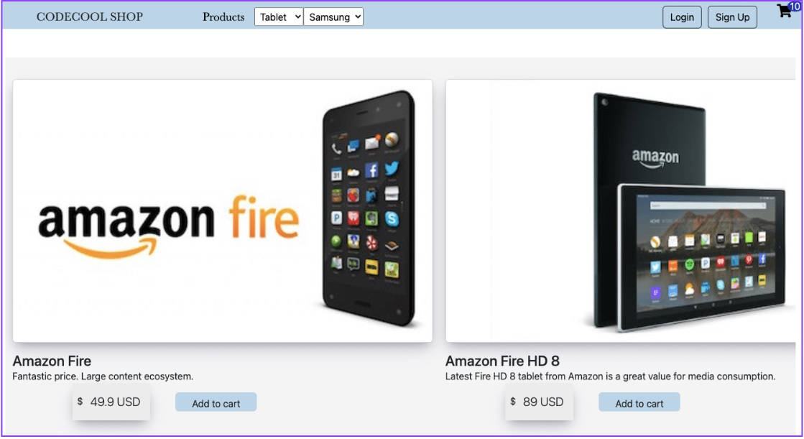

# OnlineShopWebApp---CodecoolShop
### Codecool Shop is a Java-based e-commerce app built by students for practical experience in software development. It allows browsing, searching, and purchasing products, managing orders and user profile. Codecool Shop is an excellent platform for students to learn web development, software engineering, and project management.

### Features
Browse and search for products by category or keyword
View detailed information and images of each product
Add products to a shopping cart and manage the cart contents
Complete the checkout process and place orders
Manage user profile information and view order history

### Technologies
1.  Java 
2. PostgreSQL database 
3. HTML/CSS/JavaScript

### Getting Started
To run the application locally, follow these steps:

1.  Clone the repository: git clone https://github.com/ROSUNICOLAE/OnlineShopWebApp---CodecoolShop.git
2. Open the project in your IDE of choice 
3. Set up a PostgreSQL database and configure the connection in the src/main/java/com/codecool/shop/manager/ShopDatabaseManager.java file
4. To run a Maven project with Jetty, you can use the following command in your terminal or command prompt:
   
    << mvn jetty:run >>

    This command will start the Jetty server and deploy your Maven web application. Once the application is deployed, you should be able to access it in your web browser by navigating to the appropriate URL.
### Contributors
Rosu Nicolae

### License
This project is licensed under the MIT License - see the LICENSE file for details.
